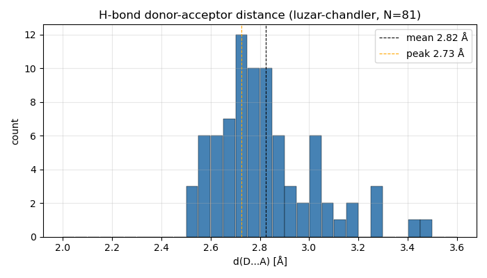
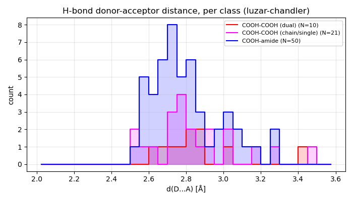
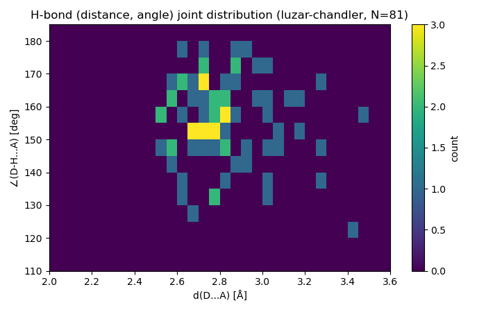

# Sample: IMC amorphous H-bond analysis

非晶質インドメタシン (IMC) の MD スナップショットに対する H-bond 検出/分類のサンプル。

## 入力

本サンプルディレクトリの `input/` に bundle されている:

- `input/IMC_result450.0_out_rec900.bdf` (1.5 MB)
  - 125 分子 (GAFF2 atomtypes)、47.34 Å cubic box (initial)、record=900 単一スナップショット
  - T=450 K MD で平衡化された amorphous state
- `input/imc-bond-nmr.png` (Yuan 2015 Mol. Pharm. 12, 4518 Figure 5、64 KB)
  - 13C CPMAS NMR で 4 種類のカルボニル環境 (cyclic dimer / chain / COOH-amide / free)
    に分離する H-bond network 帰属

別の trajectory で解析したい場合は `BDF=/path/to/my.bdf bash run_cli.sh`
または `input/IMC_result450.0_out_rec900.bdf` を差替えてください。

## 実行

### CLI ワンライナー

```bash
bash run_cli.sh
```

### Jupyter notebook

```bash
jupyter notebook run_notebook.ipynb
```

## 出力 (typical results, T=450 K, per-functional-group 4-species, v1.27 候補)

| species (Yuan 2015 NMR 帰属) | MD count | MD % | NMR % (Yuan Table 1) |
|---|---|---|---|
| dual (cyclic COOH dimer, ~179 ppm) | 10 (5 pair) | 8.0% | 58.5% |
| chain (disordered, ~176 ppm) | 41 | 32.8% | 15.2% |
| single (COOH-amide, ~172 ppm) | 38 | 30.4% | 18.9% |
| free (~170 ppm) | 36 | 28.8% | 7.5% |
| amide accept | 49 | 39.2% | — |
| amide free | 76 | 60.8% | — |
| 総 H-bond 数 (cc / ca) | 31 / 50 | — | — |
| 検出基準 | Luzar-Chandler: d_DA ≤ 3.5 Å, ∠ ≥ 120° | | |

mol-level 代表 role (色付け用): 1 mol = 1 COOH なので per-COOH と同じ
(dual=10 / chain=41 / single=38 / free=36 mols)。

比較プロット (NMR Figure 5 + Yuan Table 1 + MD bar) は
`plot_nmr_comparison.py` で `output/imc_hbond_nmr_comparison.png` を生成。

出力ファイル:
- `output/imc_hbond_summary.csv`: per-record の官能基単位集計 + mol-level legacy
- `output/imc_hbond_classification.csv`: 全 carboxyl / amide ごとの role table
- `output/imc_hbond_pairs.csv`: H-bond ペア一覧
- `output/imc_hbond.bdf`: Mol_Name 維持コピー + 各 functional-group atom の `Attributes[]` に `hbond=Dual/Single/Free/Accept` を append (J-OCTA プリ描画 + Attribute フィルタ用)
- `output/imc_hbond_colored.bdf`: Mol_Name リネーム + Draw_Attributes (3 色、`molname` モード)
- `output/imc_hbond_action.bdf` + `imc_hbond_show.act`: Mol_Name 維持 + autorun action (`action` モード、**OCTA gourmet 用**、官能基単位色付け)
- `output/imc_hbond_show.py`: autorun ラッパーなしの Python script (`action` モード、**J-OCTA Viewer の Python パネル用**、対象は `imc_hbond.bdf`)
- `output/imc_hbond_count.png`: count vs record (1 record のため点)
- `output/imc_hbond_distance_hist.png` / `_distance_by_class.png` / `_distance_angle_2d.png`: d(D...A) 距離分布 (全体 / クラス別 / (d,∠) 2-D heatmap)。`_distance_stats.csv` / `_distance_hist.csv` も同時出力 (v2.1.0 の `distance_dist` 機能、`--no-distance-plots` で抑制可)

`--colorize-mode {molname,action,both}` で経路選択 (default = molname、サンプル
`run_cli.sh` では `both` を渡して全部出している)。

### 距離 / 角度分布の出力例

`run_notebook.ipynb` の distance 経路 (prefix `imc_hbond_distplot`) で出力した例:

| A: 全体 d(D...A) | B: クラス別 | C: (d, ∠) 2-D heatmap |
|---|---|---|
|  |  |  |

`COOH-amide` (N=50) が最短側 (peak 2.72 Å)、`COOH-COOH (dual, cyclic dimer)`
(N=10) は peak 2.82 Å。Yuan 2015 IMC NMR の 4-species 帰属と整合。

## 可視化方法

### (1a) Python action 経路 — OCTA gourmet 推奨 (`<prefix>_action.bdf` + `<prefix>_show.act`)

```bash
gourmet output/imc_hbond_action.bdf
```

`autorun: showHbond()` が UDF を開いた瞬間に走り、carboxyl atoms (c/o/oh/ho) を
役割色 (red/blue/gray) + amide atoms (c/o/n) を accept=cyan / free=gray の
sphere overlay で塗り分ける。**1 分子内で COOH と amide が別役割の場合も
両方が独立色で描画**される。Mol_Name は変えないので J-OCTA プリ描画とも互換。

### (1b) Python パネル経路 — J-OCTA Viewer 推奨 (`<prefix>.bdf` + `<prefix>_show.py`)

J-OCTA Viewer は (1a) の autorun action 形式で落ちることがある。その場合は:

1. J-OCTA Viewer で `output/imc_hbond.bdf` (Mol_Name 維持 uncolored copy) を開く
2. 左下 Python パネルで `Load…` ボタンから `output/imc_hbond_show.py` を読み込み
   (または .py の内容を直接ペースト)
3. `Run` ボタンで実行 → 同じ役割色 overlay が描画される

(1a) と同じ描画ロジックだが、autorun ラッパー無しで Python パネル直接実行形式。
BDF も無改変なのでファイルの round-trip 安全。

### (2) Mol_Name リネーム経路 (`<prefix>_colored.bdf`、v1.25 legacy)

```bash
gourmet output/imc_hbond_colored.bdf
```

左パネル Python タブで `show.all("line", "mol", ...)` の 3 番目引数を **"molname"** に
書換えて Run。**分子代表 role** (priority dual > single > free) で 3 色塗分け。

### (3) J-OCTA プリ描画 + Attribute カテゴリ可視化

`output/imc_hbond.bdf` を J-OCTA で開くと、各 functional-group atom の
`Attributes[]` に `hbond=Dual/Single/Free/Accept` が入っているので、
J-OCTA の Attribute フィルタで「`hbond=Dual` の atom のみ表示」などの
カテゴリ可視化が可能 (色分けはしないが、官能基単位の役割をフィルタで確認)。

`_colored.bdf` (Mol_Name リネーム) は J-OCTA プリ描画で空表示になるので使わない。

3 色グループ:
- **Red**: IMC_DUAL (環状二量体に参加)
- **Blue**: IMC_SINGLE (アミドに H-bond)
- **Gray + transparent**: IMC_FREE (H-bond 未関与)

参考: GOURMET の Draw_Attributes.Molecule[] の color は select 型 (Red/Green/Blue/Magenta/Cyan/Yellow/White/Black/Gray) のみ。RGBA 任意色は不可。
